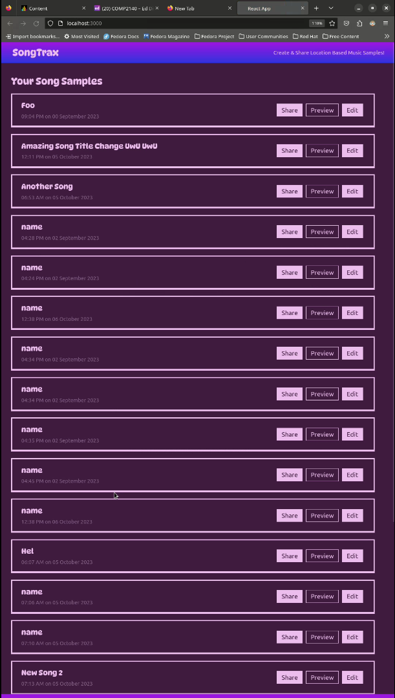
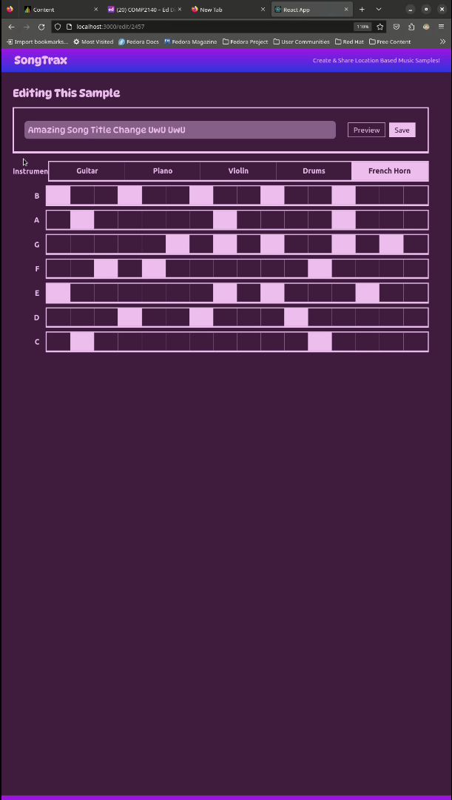
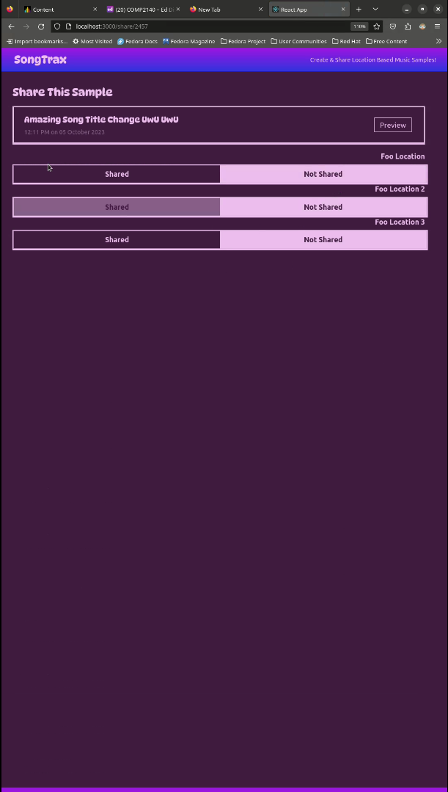

# COMP2140-ReactJS-App
A ReactJS web app developed as the second assignment for COMP2140 course in The University of Queensland. It is a reactive web app, SongTrax, developed in ReactJS that allows users to create and share song samples to a predefined set of geographic locations, it achieves this by interacting with a REST API and providing a web based UI to view, create and share song samples. The application has three primary pages.

## Song Sample List

This page lists the users song samples they created, users can preview the samples, share it or edit it.

||
|:-:|
|Song Sample List|

## Song Sample Page

This page allows users to edit an existing sample and will be displayed with empty entries when creating a new sample. It allows users to name the sample, select an instrument from the predefined list, and add notes to the sample. Users can save the edits and/or preview the changes made.

||
|:-:|
|Edit Song Sample Page|

## Song Sample Share Page

This page allows users to share and un-share the selected sample to a predefined list of locations, it also shows users if a sample has already been shared to one of the location displayed.

||
|:-:|
|Share Song Sample Page|

## Miscellaneous Features

- Responsive design, can dynamically resize components to fit different screen sizes


- Dark Mode/Light Mode, it can switch between a dark and light mode based on browser preferences.

# Getting Started

Run the following commands to install all dependencies and run the app

```bash
# For Dev Build
$ npm install
$ npm start
```

```bash
# For Production Build
$ npm install -g serve
$ npm -s build
```
